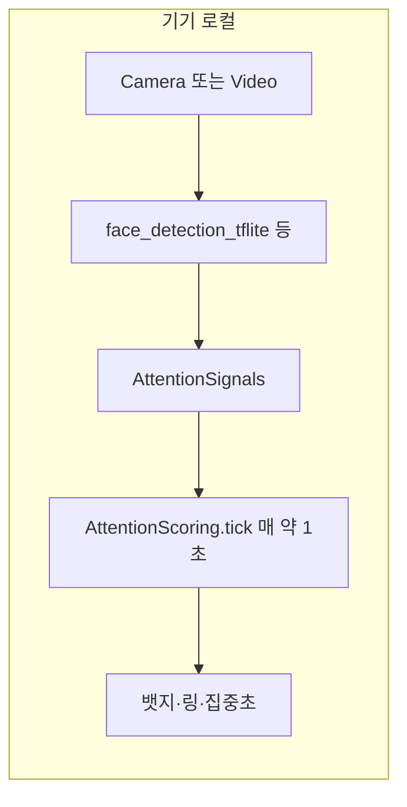

# setudy 집중도(Attention) 판단 근거와 구현 정리

이 문서는 **현재 저장소 코드**가 무엇을 측정하는지, **이론·문헌·제품 설계** 중 어디에 해당하는지 구분해 정리합니다. 임상적 졸음·주의력 결핍 진단 도구가 **아님**을 전제로 합니다.

---

## 1. 한 줄 요약

| 구분 | 내용 |
|------|------|
| 입력 | 기기 카메라(또는 웹 `<video>`)에서 **로컬**으로 얼굴 검출·랜드마크(메시) 추출 |
| 중간 표현 | [AttentionSignals](../apps/mobile/lib/src/features/session/domain/attention_signals.dart) (얼굴 유무, EAR, 요 pitch/yaw, 다중 얼굴, 포그라운드) |
| 점수 | [AttentionScoring](../apps/mobile/lib/src/features/session/domain/attention_scoring.dart)에서 **0~100 즉시 점수** 및 **틱 평균 점수** |
| UI·집계 | 뱃지 단계, 집중/이탈 초, 이벤트 카운트, 사용자 **집중민감도**([engaged_time_threshold.dart](../apps/mobile/lib/src/features/session/domain/engaged_time_threshold.dart)) |

영상·원시 프레임은 **서버로 전송하지 않는 것**을 앱 정책으로 두었으며, 구현은 플랫폼별로 카메라 스트림이 기기 내에서만 처리됩니다.

---

## 2. 데이터 파이프라인 (코드 기준)

1. **네이티브(모바일·데스크톱 앱)**  
   [face_attention_sensor_io.dart](../apps/mobile/lib/src/features/session/infra/face_attention_sensor_io.dart): `CameraController` 이미지 스트림 → `FaceDetector.detectFacesFromCameraImage` (full mesh).

2. **웹**  
   [session_self_camera_web.dart](../apps/mobile/lib/src/features/session/infra/session_self_camera_web.dart): `getUserMedia` + 캔버스로 JPEG 샘플 → `detectFaces` 등으로 `Face` 목록 → [web_attention_face_codec.dart](../apps/mobile/lib/src/features/session/infra/web_attention_face_codec.dart)에서 `AttentionSignals`로 변환.

3. **세션 루프**  
   [session_controller.dart](../apps/mobile/lib/src/features/session/presentation/session_controller.dart): `Timer.periodic(1초)`마다 최신 `signals`로 `AttentionScoring.tick` 호출.

---

## 3. 지표의 “출처”: 이론 vs 라이브러리 vs 제품 휴리스틱

### 3.1 이론·관행에 기대는 부분 (문헌·공개 스펙)

| 요소 | 근거 | setudy에서의 역할 |
|------|------|-------------------|
| **눈 윤곽 6점 + 비율로 눈 벌어짐** | Eye Aspect Ratio(EAR)류 기법은 얼굴 랜드마크 기반 눈 깜빡임·개안 정도 추정에 널리 쓰입니다. 대표적으로 Soukupová & Čech(2016)가 실시간 눈 깜빡임 검출에 EAR를 제안했습니다. | 코드의 `_ear`는 동일한 **6점·비율 공식**을 사용합니다. ([face_attention_sensor_io.dart](../apps/mobile/lib/src/features/session/infra/face_attention_sensor_io.dart) 주석, [web_attention_face_codec.dart](../apps/mobile/lib/src/features/session/infra/web_attention_face_codec.dart)) |
| **468점 메시·눈 인덱스 번호** | Google **MediaPipe Face Mesh** 계열 토폴로지에서 쓰이는 랜드마크 인덱스 관행과 정합합니다(왼쪽/오른쪽 눈 윤곽 6점 세트). | `_eyeL`, `_eyeR` 배열이 그 인덱스를 명시합니다. |
| **졸음·피로 연구 맥락** | 운전·피로 분야에서는 **PERCLOS**(일정 시간 동안 눈꺼풀 닫힘 비율) 등이 오래된 표준 지표로 쓰입니다(Dinges 등, 운전 적합성 맥락). | 본 앱은 PERCLOS를 구현하지 않고, **프레임 단위 EAR 임계값**으로 “눈 감김” 이진 판정에 가깝게 단순화했습니다. |

**참고 문헌·자료 (외부 링크)**

- Soukupová, T., & Čech, J. (2016). *Real-Time Eye Blink Detection using Facial Landmarks.* Computer Vision Winter Workshop (CVWW). PDF: [vision.fe.uni-lj.si/cvww2016/proceedings/papers/05.pdf](https://vision.fe.uni-lj.si/cvww2016/proceedings/papers/05.pdf)
- MediaPipe Face Landmarker / Face Mesh 개념·토폴로지: [Google AI Edge / MediaPipe 문서](https://ai.google.dev/edge/mediapipe/solutions/vision/face_landmarker) (제품·버전에 따라 URL은 변경될 수 있음)
- Flutter 카메라 추상화: [camera 패키지](https://pub.dev/packages/camera)

### 3.2 라이브러리·모델 출처 (추론 엔진)

| 구분 | 내용 |
|------|------|
| 패키지 | [face_detection_tflite](https://pub.dev/packages/face_detection_tflite) (`pubspec.yaml`의 `face_detection_tflite`) — **온디바이스** TFLite 추론으로 얼굴·(모드에 따라) 메시를 제공합니다. |
| 모델 세부 | 가중치 아키텍처·학습 데이터는 패키지/모델 카드에 따릅니다. 앱 코드는 “검출 결과의 `Face.mesh`”를 소비합니다. |
| 회전 보정 | 네이티브에서 `CameraDescription.sensorOrientation`에 맞춰 `CameraFrameRotation`을 넘깁니다([face_attention_sensor_io.dart](../apps/mobile/lib/src/features/session/infra/face_attention_sensor_io.dart) `_rotationFor`). |

### 3.3 제품 전용 휴리스틱 (문헌에 고정되지 않은 부분)

아래는 **연구 논문 한 편에서 그대로 가져온 값이 아니라**, 구현·UX를 위해 코드에 고정된 설계입니다. 필요 시 `docs`와 코드 주석을 함께 갱신하는 것이 좋습니다.

| 항목 | 현재 코드 | 비고 |
|------|-----------|------|
| EAR “눈 감김” 임계 | `earLeft < 0.2 && earRight < 0.2` | [attention_signals.dart](../apps/mobile/lib/src/features/session/domain/attention_signals.dart) — 카메라·해상도·개인차에 따라 튜닝 대상 |
| 시선 이탈 각도 | `\|headYaw\| > 25` 또는 `\|headPitch\| > 20` (도) | 메시 기반 **간이** 기하 추정값([face_attention_sensor_io.dart](../apps/mobile/lib/src/features/session/infra/face_attention_sensor_io.dart) `_estimateHeadPose`) — 임상 시선 추적이 아님 |
| 즉시 점수 감점 | 눈 감김 −80, 머리 이탈 −50, 다중 얼굴 −30, 얼굴 없음/백그라운드 0점 | [attention_scoring.dart](../apps/mobile/lib/src/features/session/domain/attention_scoring.dart) `_computeScore` — **가중치는 제품 설계** |
| UI 단계 경계 | `engagedMinScore`에 연동된 `focusedMin` / `normalMin` 등 | `_statusFromScore` — 민감도 UI와 동기 |
| 집중 초 히스테리시스 | `rawFocused` 후 `kFocusEnterSeconds`(2초) / `kFocusExitGraceSeconds`(2초) 래치 | 깜빡임·순간 노이즈 완화 |
| 뱃지용 스무딩 | `smoothForStatus = round(0.55*즉시점수 + 0.45*누적평균)` | 즉시 점수와 평균의 혼합 — **집중 초 누적은 `rawFocused`·래치 기준**(코드 동일 파일 `tick`) |
| 이벤트 카운트 | 졸음 연속 2초, 시선 이탈 연속 3초 시 1회 가산 | 요약·로그용 |

---

## 4. AttentionSignals가 의미하는 것 (필드별)

정의: [attention_signals.dart](../apps/mobile/lib/src/features/session/domain/attention_signals.dart)

| 필드 / 파생 | 의미 | 산출 |
|-------------|------|------|
| `facePresent` | 단일 프레임에서 얼굴 검출 성공 여부 | 검출기 결과 |
| `multiFace` | 얼굴 2개 이상 | 리스트 길이 |
| `appInForeground` | 앱이 포그라운드인지 | Flutter 생명주기·컨트롤러에서 설정 |
| `earLeft`, `earRight` | 각 눈 EAR 스칼라 | 6점 거리 비율 (Soukupová & Čech 스타일 공식) |
| `eyesClosed` | 양쪽 EAR 모두 0.2 미만 | 파생 getter |
| `headYaw`, `headPitch` | 이미지 평면상 코·눈·턱 기하로 만든 **대략적** 각도(도) | `_estimateHeadPose` |
| `headAway` | yaw/pitch 임계 초과 | 파생 getter |
| `blinkFrame` | 해당 프레임이 깜빡임으로 보이는지 | EAR 기준(구현상 `eyesClosed`와 동일 조건으로 잡히는 경우가 많음) |

---

## 5. 점수 산정 (즉시 점수 0~100)

구현: `AttentionScoring._computeScore` ([attention_scoring.dart](../apps/mobile/lib/src/features/session/domain/attention_scoring.dart))

1. `appInForeground == false` → **0**
2. `facePresent == false` → **0**
3. 그 외 **100**에서 시작해 다음을 **합산 감점**(하한 0):
   - `eyesClosed` → −80  
   - `headAway` → −50  
   - `multiFace` → −30  

**평균 점수(원형 링 등에 쓰이는 세션 평균)**  
`averageScore = round(scoreSum / scoreTicks)` (틱 없으면 100). 각 틱의 **즉시 점수**를 누적 평균합니다.

---

## 6. “집중” 판단이 두 갈래인 이유 (뱃지 vs 집중 초)

| 목적 | 사용 값 | 설명 |
|------|-----------|------|
| **뱃지** (`FocusStatus`) | `smoothForStatus` + 신호 우선순위 | 얼굴 없음 → `away`, 눈 감김 → `drowsy`가 점수보다 우선. 그 외 점수 구간은 `engagedMinScore`에 맞춘 `focusedMin`/`normalMin` 등으로 나눔(`_statusFromScore`). |
| **집중 초** | `rawFocused = (즉시점수 >= engagedMinScore && facePresent && foreground)` + **2초 진입·2초 이탈 유예 래치** | 순간 잡음에 덜 흔들리도록 설계. |

`engagedMinScore` 선택지: [engaged_time_threshold.dart](../apps/mobile/lib/src/features/session/domain/engaged_time_threshold.dart) (`80, 65, 50, 35, 20`, 기본 50).

---

## 7. 한계·주의 (사업·IR·심사용으로 읽을 때)

1. **의료기기·진단 아님**: 피로·ADHD·수면장애 등을 판정하지 않습니다. “학습 보조용 휴리스틱” 수준입니다.  
2. **웹 vs 앱**: 브라우저·GPU·모델 경로에 따라 검출 안정도가 다릅니다.  
3. **다인종·조명·마스크·안경**: 랜드마크 품질이 떨어지면 EAR·각도가 흔들립니다.  
4. **다중 얼굴 −30점**: “부정 행위”가 아니라 **측정 불확실성**에 가까운 휴리스틱이며, [SessionSummary](../apps/mobile/lib/src/features/session/domain/session_summary.dart)의 `validationState` 등과 연동될 수 있습니다.  
5. **머리 각도**: 3D 머리 자세(PnP 등)가 아니라 2D 랜드마크 기반 근사입니다.  

---

## 8. 관련 파일 목록 (추적용)

| 파일 | 역할 |
|------|------|
| [attention_signals.dart](../apps/mobile/lib/src/features/session/domain/attention_signals.dart) | 신호 스키마·임계 getter |
| [attention_scoring.dart](../apps/mobile/lib/src/features/session/domain/attention_scoring.dart) | 점수·틱·뱃지·집중초·이벤트 |
| [engaged_time_threshold.dart](../apps/mobile/lib/src/features/session/domain/engaged_time_threshold.dart) | 집중민감도 저장 |
| [face_attention_sensor_io.dart](../apps/mobile/lib/src/features/session/infra/face_attention_sensor_io.dart) | 네이티브 카메라 스트림 센서 |
| [web_attention_face_codec.dart](../apps/mobile/lib/src/features/session/infra/web_attention_face_codec.dart) | 웹·공용 얼굴→신호 변환 |
| [session_self_camera_web.dart](../apps/mobile/lib/src/features/session/infra/session_self_camera_web.dart) | 웹 카메라·샘플링 |
| [session_controller.dart](../apps/mobile/lib/src/features/session/presentation/session_controller.dart) | 틱 루프·정책 주입 |

---

## 9. 참고문헌·외부 자료 (요약 표)

| # | 인용 | 용도 |
|---|------|------|
| 1 | Soukupová & Čech (2016), CVWW — EAR·6점 눈 윤곽 | 눈 개폐 스칼라 설명 근거 |
| 2 | MediaPipe 계열 468 랜드마크 토폴로지 (Google 공개 자료) | 랜드마크 인덱스·메시 개념 |
| 3 | `face_detection_tflite` (pub.dev) | 온디바이스 추론 스택 |
| 4 | 본 저장소 `attention_scoring.dart`, `attention_signals.dart` | **실제 동작의 단일 근거** |

문서 버전: 저장소 내 코드와 함께 갱신할 것. 상충 시 **코드가 우선**입니다.
