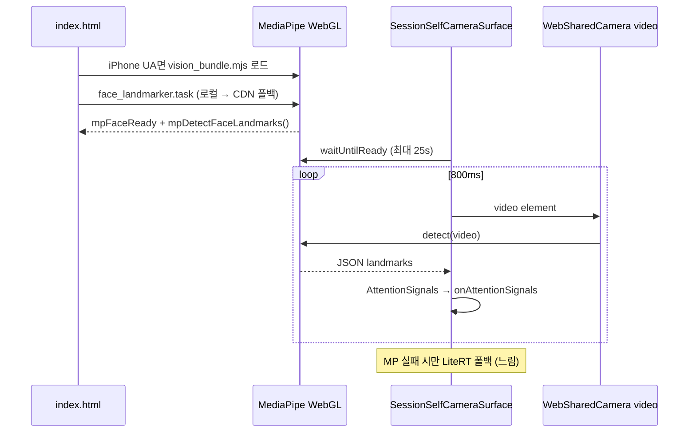

# Setudy (study_up) — 제품·기술 통합 문서

> **목적**: 이 파일만 읽고 Cursor 등에서 **거의 동일한 앱**을 다른 폴더에 재구현할 수 있도록, 프론트/백엔드·탭 UX·집중력(얼굴) 감지까지 한곳에 정리합니다.  
> **최종 갱신**: 2026-05-25  
> **앱 패키지명**: `study_up` · **저장소 루트**: `setudy/`

---

## 1. 제품 한 줄 요약

**Setudy**는 학생이 스마트폰·브라우저 카메라로 **온디바이스 얼굴 분석**을 하며 공부하고, 집중 시간·상태를 기록·보상(블럭)받는 **집중 스터디 앱**입니다.  
카메라 영상·얼굴 임베딩은 **서버에 저장하지 않고**, 세션 **요약(초·점수·이벤트 수)** 만 Supabase에 올립니다.

| 플랫폼 | 배포 형태 | 집중 감지 |
|--------|-----------|-----------|
| Android | APK / Play (Flutter) | 네이티브 `face_detection_tflite` + 카메라 스트림 |
| iOS | App Store (Flutter) | 네이티브 `face_detection_tflite` + iOS 전용 회전·라치 파이프라인 |
| Web (Chrome Android 등) | Vercel SPA | LiteRT.js WASM + `WebSharedCamera` JPEG |
| **Web (iPhone Safari)** | Vercel SPA | **MediaPipe FaceLandmarker (WebGL)** 우선 → LiteRT 폴백 |

---

## 2. 기술 스택

### 2.1 프론트엔드

| 영역 | 기술 |
|------|------|
| 프레임워크 | **Flutter 3.4+** (단일 코드베이스: iOS / Android / Web) |
| 상태 관리 | **flutter_riverpod** 2.x |
| 라우팅 | **go_router** 14.x — `StatefulShellRoute` 4탭 |
| 로컬 DB | **Drift** (SQLite) — 계획 캐시 등 |
| 설정 | **flutter_dotenv** — `.env` (Supabase URL/키, 빌드 시 생성) |
| 국제화 | `flutter gen-l10n` — 기본 `ko` |
| UI | **Material 3** — Sky Blue `#0EA5E9` + Emerald `#10B981` |
| 카메라 | **camera** 패키지 (네이티브) / **getUserMedia** (웹) |
| 얼굴 ML (네이티브) | **face_detection_tflite** ^6.2.5 — MediaPipe 468 랜드마크 |
| 얼굴 ML (웹 데스크탑·Android Chrome) | **flutter_litert** + **LiteRT.js** 2.4.0 (CDN WASM) |
| 얼굴 ML (웹 iPhone) | **@mediapipe/tasks-vision** 0.10.17 (CDN) + 자체 호스팅 `.task` 모델 |
| 알림 | flutter_local_notifications (계획 시작 알람) |
| 오디오 | audioplayers (셋터디방 앰비언트) |

### 2.2 백엔드

| 영역 | 기술 |
|------|------|
| BaaS | **Supabase** |
| 인증 | Supabase Auth — 이메일/비밀번호, **PKCE** (웹 세션 URI 복구) |
| DB | PostgreSQL + **RLS** |
| 실시간 | Supabase **Realtime** — 스터디방 presence·메시지 |
| 스토리지 | Supabase Storage — `study-snapshots` 버킷 (1분 JPEG, 얼굴 분석과 별개) |
| RPC | `award_study_room_bonus_for_session`, 코인/블럭 적립 등 SQL 함수 |

### 2.3 인프라·배포

| 대상 | 경로·명령 |
|------|-----------|
| 웹 | **Vercel** — Root `apps/mobile`, `tool/vercel_build.sh` → `flutter build web` |
| DB 마이그레이션 | `supabase/migrations/*.sql` (001~0024) |
| 웹 정적 자산 | `apps/mobile/web/` — `index.html`, `mediapipe/face_landmarker.task` (~3.6MB) |
| 환경 변수 (Vercel) | `SUPABASE_URL`, `SUPABASE_ANON_KEY`, 선택 `PREMIUM_VIDEO_ENABLED`, TURN_* |

---

## 3. 저장소 구조

```
setudy/
├── main.md                    ← 이 문서
├── plan.md                    ← 제품 로드맵 (요약)
├── apps/mobile/               ← Flutter 앱 (유일한 클라이언트)
│   ├── lib/
│   │   ├── main.dart
│   │   └── src/
│   │       ├── app.dart           # GoRouter + MaterialApp
│   │       ├── core/              # theme, supabase, providers, routing
│   │       ├── shell/             # AppShell 4탭
│   │       └── features/
│   │           ├── auth/
│   │           ├── session/       # ★ 집중 공부 + 얼굴 센서
│   │           ├── plan/
│   │           ├── study_room/    # ★ 셋터디방
│   │           ├── stats/
│   │           ├── motivation/    # 소셜·가챠
│   │           ├── coins/
│   │           └── family/
│   ├── web/
│   │   ├── index.html             # LiteRT + MediaPipe 부트스트랩
│   │   └── mediapipe/
│   │       └── face_landmarker.task
│   ├── pubspec.yaml
│   └── tool/vercel_build.sh
└── supabase/migrations/       # Postgres 스키마·RPC
```

**아키텍처 패턴**

- **Feature-first**: `features/<name>/{domain,data,infra,presentation}`
- **조건부 import**: `export 'foo_stub.dart' if (dart.library.html) 'foo_web.dart'`
- **싱글톤 카메라**: `AttentionCameraService` / `WebSharedCamera` — 탭·방 간 **카메라 1개** 공유

---

## 4. 앱 셸 · 탭 구성 · UX/UI

### 4.1 하단 네비게이션 (4탭)

`lib/src/shell/app_shell.dart` + `lib/src/app.dart` (`StatefulShellRoute.indexedStack`)

| 인덱스 | 라벨 | 경로 | 화면 | 역할 |
|--------|------|------|------|------|
| 0 | **공부** | `/session`, `/session/quick` | `SessionScreen` | 집중 타이머 + 카메라 + 집중 점수 (기본 탭) |
| 1 | **계획** | `/plan` | `PlanEditorScreen` | 주간 날짜·과목·목표 시간 |
| 2 | **셋터디** | `/room`, `/room/quick` | `StudyRoomScreen` | 멀티 스터디방·실시간 프리뷰·1분 스냅샷 |
| 3 | **기록** | `/stats` | `StatsScreen` | 집중 기록·미션·랭킹·드림시티 |

**인증**: 미로그인 → `/login` (디버그 시 `AuthFeatureFlags.devBypassAuthGate` + 익명 로그인 가능).  
**풀스크린 라우트**: `/coins`, `/family`, `/gacha`, `/social`, `/legal/*`

### 4.2 탭 전환 UX (중요)

`AppShell` `onDestinationSelected`:

1. **공부 탭에서 세션 실행 중** → 다른 탭 이동 시 다이얼로그  
   - "공부 중이에요 … 저장하고 이동?" → `sessionAutoSaveTriggerProvider` → 카메라 정리 후 이동  
2. **셋터디방만 참여 중** (세션 없음) → "방을 나가야 해요. 나가고 이동?" → `studyRoomLeaveForTabSwitchProvider`

### 4.3 UI/브랜딩

- `lib/src/core/theme/app_color_schemes.dart` — Light/Dark Material 3  
- 과목별 색상 프리셋 (계획 화면)  
- 집중 민감도: `EngagedSensitivityMetroCard` — 점수 하한 80·65·50·35·20 (`engaged_time_threshold.dart`)

### 4.4 공부 탭 (`SessionScreen`) UX 흐름

1. 오늘 계획 로드 → 과목 선택  
2. **공부 시작** — 웹: `WebSharedCamera.openFromUserGesture()` **버튼 핸들러 맨 앞** (Safari 필수)  
3. 카메라 프리뷰 + 실시간 상태 배지 (집중/보통/이탈/졸음/자리이탈)  
4. 1초 틱: `AttentionScoring.tick` → 집중 초·평균 점수  
5. 종료 → `SessionEndResultSheet` — 공부 시간, 계획 달성, 연속 달성, 블럭 보너스  
6. 웹: `SessionSelfCameraSurface`가 `onAttentionSignals` → `SessionController.applyWebAttentionSignals`

### 4.5 셋터디 탭 UX

- 방 생성/입장, **스터디 그룹 목표** 한 줄 (`StudyRoomGoalSheet`)  
- **본인**: `StudyRoomSelfLivePanel` — 공부 탭과 **동일** `AttentionCameraService` / 웹은 `SessionSelfCameraSurface`  
- **다른 멤버**: `StudyRoomMemberCard` — **1분마다** 업로드된 JPEG URL (`snapshotUrl`, 60초 간격)  
- 퇴장 시 집중 5분 이상 → **+3 블럭** (`StudyRoomRewardConfig`, RPC `study_room_bonus`)  
- Realtime presence + 채팅 메시지

---

## 5. 집중력(얼굴) 감지 — 핵심 도메인

### 5.1 신호 → 점수 파이프라인 (공통)

```
카메라 프레임
    → FaceDetector / MediaPipe
    → AttentionSignals (1프레임)
    → AttentionScoring.tick (1초)
    → FocusStatus + focusedSeconds + averageScore (0~100)
    → SessionSummary (종료 시 Supabase 저장, 영상 없음)
```

**`AttentionSignals`** (`domain/attention_signals.dart`)

| 필드 | 의미 |
|------|------|
| `facePresent` | 얼굴 검출 |
| `multiFace` | 2인 이상 |
| `earLeft`, `earRight` | EAR — &lt; 0.2 눈 감김 |
| `headYaw`, `headPitch` | \|yaw\|&gt;25° 또는 \|pitch\|&gt;20° 시선 이탈 |
| `blinkFrame` | 깜빡임 프레임 |
| `appInForeground` | 앱 포그라운드 (백그라운드면 0점) |

**`AttentionScoring`** (`domain/attention_scoring.dart`)

- 상태: `focused` / `normal` / `distracted` / `drowsy` / `away`
- 히스테리시스: 집중 진입 2초, 이탈 grace 2초
- 점수: 얼굴 없음·백그라운드 0, 졸음 -80, 이탈 -50, 다중얼굴 -30

### 5.2 플랫폼별 구현 맵

| 플랫폼 | 진입 파일 | 감지 엔진 | 프레임 소스 |
|--------|-----------|-----------|-------------|
| Android/iOS 앱 | `face_attention_sensor_io.dart` | `FaceDetector` + `detectFacesFromCameraImage` | `CameraController.startImageStream` |
| Web (비 iPhone) | `session_self_camera_web.dart` | `WebFaceDetectorHolder` → LiteRT | `WebSharedCamera.captureJpeg` |
| Web (iPhone) | 동일 + `web_mediapipe_face_detector.dart` | **MediaPipe** 우선 | `<video>` 직접 `detect()` |
| 보조 웹 | `face_attention_sensor_web.dart` | 위와 동일 분기 | `AttentionCameraService` 경로 |

**조건부 export**

```dart
// face_attention_sensor.dart
export 'face_attention_sensor_io.dart'
    if (dart.library.html) 'face_attention_sensor_web.dart';

// session_self_camera.dart
export 'session_self_camera_stub.dart'
    if (dart.library.html) 'session_self_camera_web.dart';
```

### 5.3 Android (네이티브 + 웹 Chrome) — 잘 되는 이유

**네이티브 앱**

- `FaceDetector.initialize` 후 YUV420 스트림, `rotationForFrame` 1회, `FaceDetectionMode.full`, `maxDim: 320`
- 타임아웃 1.5초/프레임 — 실패 시 noFace

**웹 (Android Chrome)**

- LiteRT WASM + WebGL/WebGPU 가속 가능
- `FaceDetector.create(liteRtAccelerator: auto → wasm)` 수 초~수십 초 내 준비
- JPEG 캡처 480px → fast → full 2단계 검출

### 5.4 iPhone — 그동안 안 됐던 이유 (웹 Safari)

| # | 원인 | 증상 |
|---|------|------|
| 1 | **LiteRT WASM ~20MB** + iOS **WASM JIT 제한** | 최초 로드 **1~2분**, 사용자 이탈 |
| 2 | `waitForLiteRt(120초)` **블로킹** 후에야 `FaceDetector.create` | 체감 3~4분 |
| 3 | 가속기 순서 **`wasm` 우선** (WebGPU `auto` 미활용) | iOS 17+에서도 느린 경로 고정 |
| 4 | **`index.html` ES 모듈 최상단 `return`** | MediaPipe 스크립트 **SyntaxError → 전체 미실행** (수정됨) |
| 5 | CDN·타임아웃만 늘리고 **UX만 "1~2분 기다리세요"** | 신뢰도 하락 |

**네이티브 iOS 앱**은 별도: `ios_attention_face_pipeline.dart` — 다중 회전 후보, fast→full, EAR·score 게이트, 2프레임 라치. (웹 Safari 이슈와 다름)

### 5.5 iPhone 웹 — 지금 작동하는 구조 (2026-05-25 기준)



#### A. `apps/mobile/web/index.html`

1. **LiteRT** (모든 플랫폼, iPhone은 폴백): jsdelivr → unpkg, `litert-ready` 이벤트  
2. **MediaPipe** (iPhone/iPad/iPod만, `if (UA) { ... }` 블록 — **`return` 금지**):
   - `@mediapipe/tasks-vision@0.10.17`
   - 모델: `new URL('mediapipe/face_landmarker.task', base.href)` → 실패 시 Google Storage URL
   - `delegate: 'GPU'`, `runningMode: 'IMAGE'`
   - `window.mpDetectFaceLandmarks(videoEl)` → `{ n, pts }` JSON
   - `mediapipe-ready` 이벤트

#### B. `web_mediapipe_face_detector.dart`

- `isReady` ← `window.mpFaceReady`
- `waitUntilReady` ← `mediapipe-ready` 리스너
- `detectFromVideo(video, inForeground)` → EAR·headPose → `AttentionSignals`

#### C. `session_self_camera_web.dart`

```text
_ensureDetector():
  iPhone → MediaPipe waitUntilReady → ready면 UI 해제
         → 실패 시 WebFaceDetectorHolder (LiteRT)

_sampleFrame():
  iPhone && MediaPipe.isReady → detectFromVideo(video) → 신호 전송 (즉시 return)
  else → LiteRT JPEG fast/full
```

#### D. 앱 시작 예열

`main.dart`: `warmUpWebAttentionStack()` — 웹에서 `WebFaceDetectorHolder.warmUp()` (30s 타임아웃, 백그라운드 재시도).  
iPhone 주 경로는 **HTML에서 이미 시작하는 MediaPipe**가 더 중요.

#### E. 자체 호스팅 모델

- 파일: `web/mediapipe/face_landmarker.task` (~3.6MB)  
- 빌드 시 `build/web/mediapipe/` 포함, **Flutter service worker**가 재방문 캐시

### 5.6 카메라 공유 (웹)

**`WebSharedCamera`** 싱글톤

- `openFromUserGesture()` — Safari는 **사용자 탭 직후** `getUserMedia` 필수  
- `acquire()` / `release()` 참조 카운트 — 공부·셋터디·스냅샷 **스트림 1개**  
- `captureJpeg(maxDim, quality)` — canvas drawImage → JPEG (LiteRT 경로)  
- `forceRelease()` — 세션/방 종료 시 즉시 stop

### 5.7 네이티브 iOS 파이프라인 요약

`face_attention_sensor_io.dart` → `_detectIOS`:

1. `IosAttentionFacePipeline.rotationCandidates` — 기종별 sensor orientation 차이  
2. 각 회전: fast → `passesFastGate` → full → `filterTrustworthy`  
3. 최고 `rankFace` 선택, ≥0.92면 조기 종료  
4. `_iosStabilizeFacePresent` — 2프레임 ON / 1프레임 OFF 라치  
5. `ResolutionPreset.low`, 프레임 간격 ≥350ms, stop 후 1.5s delay (AVFoundation)

### 5.8 셋터디방에서의 집중·영상

| 구분 | 본인 | 다른 멤버 (최대 3명 등) |
|------|------|-------------------------|
| 실시간 집중 | 로컬 MediaPipe/LiteRT/네이티브 TFLite | 불가 (프라이버시) |
| 화면 확인 | 본인 `<video>` / CameraPreview | **1분 JPEG** 스냅샷 URL (Storage) |
| 업로드 | `StudyRoomController` `_snapshotTimer` 60s | 동일 |

본인 집중은 `StudyRoomController.feedFocusSignals` + `AttentionScoring` (공부 탭과 동일).

---

## 6. 백엔드 (Supabase) 요약

### 6.1 핵심 테이블 (0001_init 기준)

| 테이블 | 용도 |
|--------|------|
| `profiles` | auth.users 1:1, role(student/parent/…) |
| `plans` / `plan_items` | 일별 계획·과목·목표 초 |
| `study_sessions` | 세션 요약만 (started/ended, focused_seconds, scores, validation) |
| `parent_links` | 부모-자녀 |
| `coin_balances` / `coin_events` | 블럭·교환 코인 (asset=block/coin) |

**원칙** (0001_init 주석): 카메라 프레임·face embedding **저장 금지**.

### 6.2 스터디방 관련 마이그레이션

- `0013_study_room_snapshots.sql` — 스냅샷 메타  
- `0014_study_room_messages.sql` — 채팅  
- `0018` — 호스트 이전  
- `0019` / `0020` — RLS 재귀 방지  
- **`0024_study_room_bonus.sql`** — `award_study_room_bonus_for_session` (퇴장 블럭 보너스)

### 6.3 클라이언트 Supabase

- `lib/src/core/supabase/supabase_config.dart` — `.env` 검증  
- `lib/main.dart` — `Supabase.initialize`, PKCE, `detectSessionInUri: true`

---

## 7. 보상·경제 (MVP)

| 통화 | 용도 |
|------|------|
| **블럭** | 앱 내 보상 — 세션·계획·셋터디 보너스 |
| **코인** | 교환용 (서포터 블럭→코인 RPC, 기프티콘 등은 Phase) |

**셋터디 보너스 (현재 설정)** — `StudyRoomRewardConfig`:

- 집중 **5분 이상** 퇴장 시 **+3 블럭** (세션당 1회, kind=`study_room_bonus`)

---

## 8. 재구현 시 필수 파일 체크리스트 (Cursor용)

### 8.1 뼈대

- [ ] `pubspec.yaml` — riverpod, go_router, supabase, camera, face_detection_tflite, flutter_litert  
- [ ] `lib/main.dart` + `lib/src/app.dart` — 4탭 shell, auth redirect  
- [ ] `lib/src/shell/app_shell.dart` — 탭 가드 다이얼로그  
- [ ] `.env` + `SupabaseConfig`

### 8.2 집중 감지 (가장 중요)

- [ ] `domain/attention_signals.dart`  
- [ ] `domain/attention_scoring.dart`  
- [ ] `infra/face_attention_sensor_io.dart`  
- [ ] `infra/ios_attention_face_pipeline.dart`  
- [ ] `infra/attention_camera_service.dart`  
- [ ] `web/index.html` — LiteRT + **iPhone MediaPipe (if 블록, no top-level return)**  
- [ ] `web/mediapipe/face_landmarker.task`  
- [ ] `infra/web_shared_camera.dart`  
- [ ] `infra/web_mediapipe_face_detector.dart`  
- [ ] `infra/web_face_detector_holder.dart`  
- [ ] `infra/session_self_camera_web.dart`  
- [ ] `infra/web_attention_face_codec.dart`  
- [ ] `infra/web_platform_bootstrap_web.dart`  
- [ ] `presentation/session_controller.dart` — `applyWebAttentionSignals`

### 8.3 셋터디

- [ ] `infra/study_room_controller.dart` — presence, 60s snapshot, focus tracking  
- [ ] `presentation/widgets/study_room_self_live_panel.dart`  
- [ ] `infra/room_snapshot_web.dart`  
- [ ] Supabase `0024_study_room_bonus.sql`

### 8.4 DB

- [ ] `supabase/migrations/0001_init.sql` 이후 순서대로 적용

---

## 9. 로컬 실행·배포

```bash
# 앱 디렉터리
cd apps/mobile

# .env (로컬)
# SUPABASE_URL=...
# SUPABASE_ANON_KEY=...

flutter pub get
flutter run -d chrome          # 웹
flutter run -d <ios/android>   # 네이티브

# 웹 프로덕션 (Vercel과 동일)
flutter build web --release --no-tree-shake-icons --no-web-resources-cdn
```

**iPhone Safari 테스트 시 확인**

1. DevTools 콘솔: `[setudy] MediaPipe FaceLandmarker ready (iPhone)`  
2. `mediapipe/face_landmarker.task` 네트워크 200  
3. UI "얼굴 분석 준비 중…" 이 **수십 초 내** 사라지고 상태 배지 변화  
4. 실패 시: `MediaPipe init failed` 로그 → CDN/경로/base href 점검

---

## 10. 알려진 제약·향후

| 항목 | 내용 |
|------|------|
| 구형 iPhone + MediaPipe 실패 | LiteRT 폴백은 여전히 느릴 수 있음 → **네이티브 앱 설치** 권장 |
| 웹 WASM dry-run 경고 | `dart:html` / `dart:js_util` — 현재 JS 빌드는 정상 |
| WebRTC 실시간 타일 | MVP는 1분 스냅샷; 본인만 실시간 `<video>` |
| TURN / Premium | `.env` `TURN_*`, `PREMIUM_VIDEO_ENABLED` — 선택 |

---

## 11. 관련 문서

- `plan.md` — 로드맵·완료/예정 기능  
- `docs/사업계획서_PSST_정부지원사업.md` — 사업 맥락  
- 대화·수정 이력: Cursor agent transcript `2c3098af-5d05-4864-ac33-0816c9b1c778`

---

*이 문서는 코드베이스 `apps/mobile` 및 `supabase/migrations`를 기준으로 작성되었습니다. 구현 변경 시 **§5.5 iPhone 웹** 과 `web/index.html` 을 가장 먼저 동기화하세요.*
